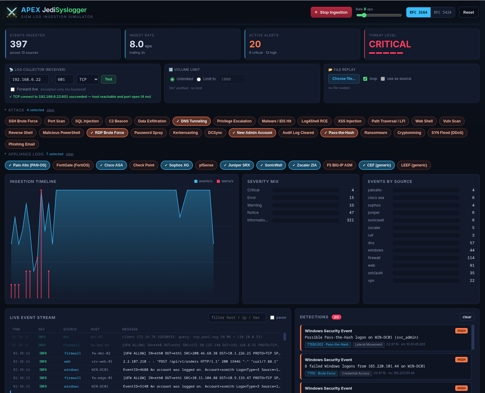

# ⚔️ APEX JediSyslogger

A browser-based **SIEM log-ingestion simulator** for security / detection-engineering
practice. It has two halves:

| Component     | Role |
|---------------|------|
| **Syslogger** | A synthetic log source. Emits realistic **RFC 3164** and **RFC 5424** syslog plus **20 appliance formats** (Palo Alto, FortiGate, Cisco ASA, Cisco FTD, Cisco ISE, Check Point, Sophos, pfSense, Juniper SRX, SonicWall, Zscaler, F5 BIG-IP ASM, Snort 3, HAProxy, BIND 9, Postfix, Windows Event Log via Snare, Linux auditd, and generic CEF/LEEF) from simulated infrastructure at a configurable *events-per-second*, injects **26 attack scenarios** on demand, and can replay a log file in a loop. |
| **Jedi**      | A miniature SIEM engine. Ingests every event, keeps rolling statistics, and runs a **stateful detection-rule engine** that raises **MITRE ATT&CK-tagged** alerts. |

The dashboard runs entirely in the browser. An optional **zero-dependency Node
backend** (`server.js`) lets it forward the generated logs as **real UDP/TCP
syslog** to an actual collector and test connectivity to it.

> 📖 **Full technical reference:** [DOCUMENTATION.md](DOCUMENTATION.md) — architecture,
> every scenario & detection rule, the HTTP API, log formats, and deployment.



## Install on a new machine

The app is a static web front-end plus an optional **zero-dependency Node
backend**. The only thing the target machine needs is **Node.js** — there is no
`npm install` and no build step.

**1. Install Node.js** — version 14 or newer (any current LTS). From your package
manager or <https://nodejs.org>. Verify:

```bash
node --version
```

**2. Get the code** — clone it, or download an archive if you don't have git:

```bash
# Option A — clone with git
git clone https://gitlab.supportlab.cloud/alfreddgreat/apex-jedisyslogger.git
cd apex-jedisyslogger

# Option B — download a tarball (no git required)
curl -L -o apex.tar.gz \
  "https://gitlab.supportlab.cloud/alfreddgreat/apex-jedisyslogger/-/archive/main/apex-jedisyslogger-main.tar.gz"
tar xzf apex.tar.gz && cd apex-jedisyslogger-main
```

*(Or on GitLab: **Code ▾ → Download source code → zip/tar.gz**, then unpack it.)*

**3. Start it** and open the dashboard in a browser:

```bash
node server.js                 # serves the app on http://localhost:8099
```

That's the entire install. For a custom port, a systemd service, or firewall
rules see [Run it](#run-it) below and
[DOCUMENTATION.md §13](DOCUMENTATION.md#13-deployment).

## Run it

```bash
# Recommended — serves the app AND enables live forwarding + the connectivity test
node server.js                 # then browse to http://localhost:8099
PORT=9000 node server.js       # custom port

# Static-only (no forwarding / no connectivity test)
python3 -m http.server 8080    # then browse to http://localhost:8080
xdg-open index.html            # or just open the file (file://)
```

> **Forwarding to a real IP requires `node server.js`.** A browser page cannot
> open raw UDP/TCP sockets, so it can never send syslog on its own — the Node
> process is what actually emits the packets.

## Deploy to a server

```bash
# from the project directory, copy to the target host
rsync -av --exclude '.git' ./ alfreddgreat@172.26.250.20:/home/alfreddgreat/APEX_JediSyslogger/

# on the server
cd /home/alfreddgreat/APEX_JediSyslogger
node server.js                 # foreground
# or run it detached:
nohup node server.js > apex.log 2>&1 &
```

Requires **Node.js** on the target (no npm install — zero dependencies). Then
browse to `http://<server-ip>:8099`. See [DOCUMENTATION.md §13](DOCUMENTATION.md#13-deployment)
for a systemd unit and firewall notes.

## Using it

1. **Start Ingestion** — begins benign baseline traffic. Drag the **Rate** slider
   (0–60 eps) to change volume.
2. **Attack ›** — inject a burst of malicious activity and watch **Detections**
   correlate it. **Appliance logs ›** — inject Palo Alto / FortiGate / Cisco ASA /
   Check Point events in their native wire formats.
3. Toggle **RFC 3164 / RFC 5424** for the generic sources. Click any event to see
   the **raw line + parsed fields** (appliance events keep their vendor format).
4. **Filter** the live stream, **pause** it, or **Reset** all state.

### Source & delivery configuration

| Control | What it does |
|---------|--------------|
| **Log collector (receiver)** | Destination `IP : port` + protocol (**UDP/TCP**) that logs are forwarded/tested against. |
| **Test** | Probes reachability of that IP:port. TCP = real connect (open / refused / timeout). UDP = ICMP probe (detects "nothing listening"; open ports are inconclusive by nature). |
| **Forward live** | Relays every generated log line to the collector as real syslog via the Node backend. The status line shows a live count; UDP is *sent* (fire-and-forget, no delivery ack), TCP is *delivered*. |
| **Volume limit** | **Unlimited**, or cap the total number of logs to an integer — ingestion auto-stops at the cap. |
| **File replay** | Load a `.log`/`.txt`/`.csv` file; enable **use as source** to replay its lines (each parsed into an event), **loop** to repeat endlessly. See `samples/sample.log`. |

## Live forwarding & troubleshooting

`Forward live` → the browser posts batches to `POST /forward`, and the backend
emits them to your collector. Because **UDP is fire-and-forget**, a rising
"sent" count means packets *left your machine* — not that the SIEM received them.
If your SIEM shows nothing:

1. **Click Test** (or switch to **TCP**). TCP gives a definitive answer:
   *connect succeeded* (reachable + listening), *connection refused* (nothing on
   that port), or *timeout* (firewall/routing).
2. **Watch the `node server.js` console** — it logs every forward:
   `→ forwarded N line(s) to <IP>:<port>/udp`.
3. **`sudo tcpdump -n -i any port 514` on the collector.** Packets seen but not
   ingested → the SIEM's syslog input isn't configured for that port/proto.
   No packets → a firewall between the hosts (port 514 also needs root on the receiver).

## Detection rules

| Rule | Trigger | ATT&CK |
|------|---------|--------|
| SSH Brute-Force | ≥ 8 failed `sshd` logins from one IP / 60s | T1110 |
| Login After Brute Force | `Accepted password` following a failure burst | T1078 |
| Horizontal Port Scan | ≥ 15 distinct denied dst ports from one IP / 30s | T1046 |
| SQL Injection | SQLi patterns in an HTTP request | T1190 |
| C2 / Known-Bad Destination | Internal host → threat-intel IP | T1071 |
| Large Outbound Transfer | Outbound flow > 100 MB | T1048 |
| DNS Tunneling | Very long DNS label / known-bad domain | T1071.004 |
| Privilege Escalation | `sudo … USER=root` / Windows EventID 4672 | T1068 |
| IDS Malware Signature | Suricata/ET trojan / exploit hit | T1204 |
| Web Application Attack | Log4Shell / XSS / traversal / web shell / scanner UA | T1190 · T1059 · T1083 · T1505.003 · T1595 |
| Windows Security Event | RDP brute / spray / Kerberoasting / DCSync / new admin / log-clear / PtH | T1110 · T1558.003 · T1003.006 · T1136 · T1070.001 · T1550.002 |
| Reverse Shell | `/dev/tcp/`, `nc -e`, `bash -i >&` | T1059 |
| Suspicious PowerShell | `powershell -enc` / `FromBase64String` / hidden window | T1059.001 |
| Cryptomining | `stratum+tcp` / known mining pool | T1496 |
| Ransomware | shadow-copy deletion / mass `.locked` rename | T1486 |
| DoS / Flood | SYN-flood markers or a volumetric block burst to one host | T1498 |
| Phishing Email | SPF/DKIM/DMARC fail + risky attachment | T1566 |
| RADIUS / 802.1X Brute Force | ≥ 6 Cisco ISE `5400` auth failures from one MAC / 60s | T1110 |
| Root Shell From Unprivileged Login | auditd `SYSCALL` with `auid`≠0 but `uid=0` | T1548 |
| Appliance IPS / WAF Signature | any appliance threat/violation signature | T1190 (mapped by signature) |

**Scenarios** — 26 attacks (`Attack ›`) and 20 appliance formats (`Appliance logs ›`).
Every scenario is wired to a detection, so each button demonstrably lights up the
dashboard. The **Threat Level** meter aggregates recent alerts (last 2 min) weighted
by severity, DEFCON-style: `GUARDED → ELEVATED → HIGH → SEVERE → CRITICAL`.

## Attack scenarios (26)

Injected from the **Attack ›** menu; each button fires a burst built to trip a
detection. Full detail — burst sizes, payloads, and the rule each one fires — is
in [DOCUMENTATION.md §5](DOCUMENTATION.md#5-attack-scenarios).

- **Network / recon** — Port Scan · SYN Flood (DDoS) · C2 Beacon · DNS Tunneling · Data Exfiltration · Cryptomining
- **Web application** — SQL Injection · Log4Shell RCE · XSS Injection · Path Traversal / LFI · Web Shell · Vuln Scan
- **Credential / identity** — SSH Brute Force · RDP Brute Force · Password Spray · Kerberoasting · DCSync · Pass-the-Hash
- **Endpoint / execution** — Reverse Shell · Malicious PowerShell · Privilege Escalation · Malware / IDS Hit · Ransomware
- **Windows persistence / evasion** — New Admin Account · Audit Log Cleared
- **Email** — Phishing Email

## Appliance log formats (20)

Injected from the **Appliance logs ›** menu — each event is rendered in the
vendor's real wire format (syslog `<PRI>` + native payload). Full example lines
and detection mapping: [DOCUMENTATION.md §6](DOCUMENTATION.md#6-appliance-log-formats).

| Appliance | Format | Detection |
|-----------|--------|-----------|
| Palo Alto (PAN-OS) | CSV | `appliance-threat` |
| FortiGate (FortiOS) | `key=value` | `appliance-threat` |
| Cisco ASA | `%ASA-lvl-id` | `c2-beacon` |
| Check Point | `key=value;` | `c2-beacon` |
| Sophos XG | `key=value` | `appliance-threat` |
| pfSense | filterlog CSV | `c2-beacon` |
| Juniper SRX | RT_FLOW | `c2-beacon` |
| SonicWall | `id/sn key=value` | `appliance-threat` |
| Zscaler ZIA | NSS `key=value` | `appliance-threat` |
| F5 BIG-IP ASM | `key=value` (WAF) | `appliance-threat` |
| Cisco FTD (Firepower) | `%FTD-lvl-id` + `Key: Value` | `appliance-threat` |
| Cisco ISE (RADIUS) | segmented + `key=value` | `radius-brute` |
| Snort 3 (IDS) | `[gid:sid:rev]` tokens | `appliance-threat` |
| HAProxy | positional + termination flags | `appliance-threat` |
| BIND 9 (DNS) | `named` query log | `dns-tunneling` |
| Postfix (mail) | prose + `key=<value>` | `appliance-threat` |
| Windows Event Log (Snare) `agent` | TAB-delimited `MSWinEventLog` | `windows-threat` |
| Linux auditd `agent` | `type=… msg=audit(ts:serial)` | `auditd-rootshell` |
| CEF (generic) | ArcSight CEF | `appliance-threat` |
| LEEF (generic) | QRadar LEEF | `appliance-threat` |

Appliances carrying an IPS/WAF signature fire **`appliance-threat`**; the pure
firewalls (Cisco ASA, Check Point, pfSense, Juniper) route their malicious event
through **`c2-beacon`** (internal host → threat-intel IP) instead. Two sources are
correlation-driven rather than signature-driven: **Cisco ISE** emits a burst of
RADIUS rejects that `radius-brute` counts over a 60 s window, and **BIND 9** emits
DGA-length and known-bad queries that `dns-tunneling` catches.

**Transport matters.** Most sources are **native syslog** — the device emits the
format itself. Two are not: Windows has no syslog (a **Snare**/NXLog agent relays
the Event Log) and **auditd** needs the `audisp-syslog` plugin. Those carry an
`agent` badge on their button, because presenting them as native syslog devices
would teach something false. Every button reports its transport on hover.

Snare is Windows Event Log over a different wire format, so it reuses the existing
`windows-threat` rule — same event IDs (4624/4625/4688), no duplicate rule.

## Project layout

```
index.html        markup + panel scaffold
css/styles.css    dark SIEM theme
js/data.js        data pools, RNG, RFC 3164/5424 + vendor line formatting
js/syslogger.js   log generator, appliance sources, scenarios, file replay, forwarding
js/jedi.js        SIEM engine: parsing, correlation, detection rules
js/ui.js          dashboard rendering + wiring
server.js         optional Node backend: static host + /forward relay + /test probe
samples/sample.log  example mixed-format log for the file-replay demo
```

## Extending it

- **Add a log source**: add a builder to `BASELINE` in `syslogger.js` and a
  `SOURCE_META` entry in `ui.js`.
- **Add an appliance format**: add a formatter to `VENDOR_FORMATTERS` in `data.js`
  and an entry to `APPLIANCE` in `syslogger.js`.
- **Add a detection**: push a rule object into `makeRules()` in `jedi.js`. Use
  `ctx.window()` / `ctx.windowSet()` / `ctx.cooldown()` for stateful correlation.
- **Add a scenario**: add an entry to `SCENARIOS` in `syslogger.js`.

---

Created By: **Alfredo Nacino** · [www.alfredonacino.com](https://www.alfredonacino.com) · alfredo@nacino.net
