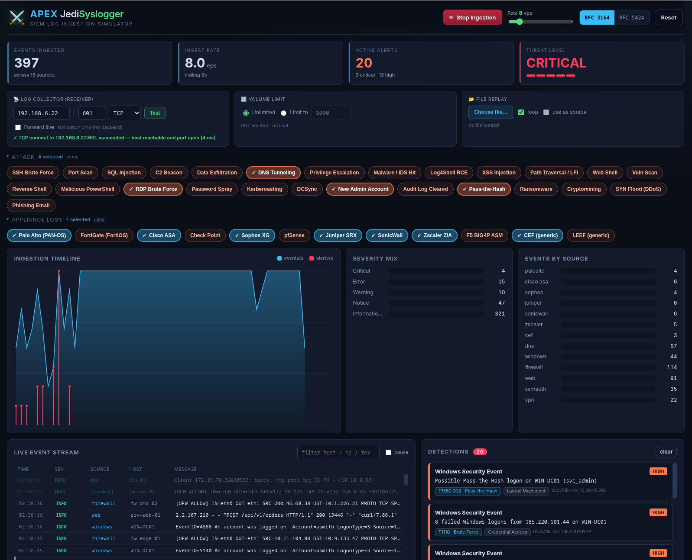

# ⚔️ APEX JediSyslogger

A browser-based **SIEM log-ingestion simulator** for security / detection-engineering
practice. It has two halves:

| Component     | Role |
|---------------|------|
| **Syslogger** | A synthetic log source. Emits realistic **RFC 3164** and **RFC 5424** syslog plus **42 appliance formats** (firewalls and NGFW, IDS/NDR, proxies, DNS/DDI, mail and email security, VPN gateways, a PAM vault, hypervisor, backup, endpoint EDR, and cloud/SaaS control planes — Palo Alto, FortiGate, Cisco ASA/FTD/IOS/ISE/ESA/Meraki/Umbrella, Check Point, Sophos, pfSense, Juniper SRX, SonicWall, Zscaler, F5 BIG-IP ASM, NetScaler, Ivanti Connect Secure, Snort 3, Suricata, Zeek, HAProxy, Squid, BIND 9, Infoblox NIOS, Postfix, CyberArk, Veeam, VMware ESXi, Windows Event Log via Snare, Sysmon, Linux auditd, AWS CloudTrail, Azure Activity, Microsoft 365, Entra ID, Defender for Endpoint, Okta, CrowdStrike, Kubernetes audit, and generic CEF/LEEF) from simulated infrastructure at a configurable *events-per-second*, injects **72 attack scenarios** on demand, and can replay a log file in a loop. |
| **Jedi**      | A miniature SIEM engine. Ingests every event, keeps rolling statistics, and runs a **stateful detection-rule engine** that raises **MITRE ATT&CK-tagged** alerts. |

The dashboard runs entirely in the browser. An optional **zero-dependency Node
backend** (`server.js`) lets it forward the generated logs as **real UDP/TCP
syslog** — or as **Splunk HEC** events over HTTP(S) — to an actual collector, and
test connectivity to it. The backend is **multi-user**, behind a **password +
two-factor sign-in**, and each account keeps its own Log Collector settings (see
[Signing in](#signing-in)) — it can put real traffic on your network, so it does
not answer to just anyone who can reach the port.

> 📖 **Full technical reference:** [DOCUMENTATION.md](DOCUMENTATION.md) — architecture,
> every scenario & detection rule, the HTTP API, log formats, and deployment.



## Three ways to run it, one version

| | Runs | Needs |
|---|---|---|
| **Desktop app** | its own window, no URL, no sign-in | Node 18+ |
| **Terminal build** | `jedi` → a live dashboard in the terminal, or headless | Node 18+ |
| **Server** | `node server.js` → a browser, with sign-in | Node 18+, a browser |

The **desktop app** is what the packages install: a menu entry on Linux, a
Start Menu shortcut on Windows, a `.app` bundle on macOS. It starts the backend
on `127.0.0.1` with a port it picks itself, hands the window a single-use ticket
for its session, and stops everything when the window closes — there is no
server to manage and nothing listening on the network.

All three load the *same* engine (`js/data.js`, `js/syslogger.js`, `js/jedi.js`), so a
scenario raises the same detection in each, and all report the same version —
there is one version number, in `js/version.js`, and
`packaging/version.sh --check` fails the build if any package disagrees.

The terminal build is the one to run on a collector, a jump box, or anywhere
without a browser: it opens the socket itself, so **no backend is needed** to
forward.

```bash
./bin/jedi desktop                             # the app, in its own window
./bin/jedi                                     # live dashboard in the terminal
./bin/jedi --forward udp://10.0.0.50:514 --eps 20 --quiet
./bin/jedi attack m365-mail-exfil --json | jq '.[0].alerts'
./bin/jedi --help
```

See [Terminal build](#terminal-build) below for the full command set, and
[DOCUMENTATION.md §16](DOCUMENTATION.md#16-the-terminal-build) for how it works.

## Install on a new machine

The app is a static web front-end plus an optional **zero-dependency Node
backend**. The only thing the target machine needs is **Node.js** — there is no
`npm install` and no build step.

**1. Install Node.js** — version 14 or newer (any current LTS). From your package
manager or <https://nodejs.org>. Verify:

```bash
node --version
```

**2. Get the code** — clone it, or download an archive if you don't have git:

```bash
# Option A — clone with git
git clone https://github.com/alfredonacino/APEX-Jedi-Syslogger.git
cd APEX-Jedi-Syslogger

# Option B — download a tarball (no git required)
curl -L -o apex.tar.gz \
  "https://github.com/alfredonacino/APEX-Jedi-Syslogger/archive/refs/heads/main.tar.gz"
tar xzf apex.tar.gz && cd APEX-Jedi-Syslogger-main
```

*(Or on GitHub: **Code ▾ → Download ZIP**, then unpack it.)*

**3. Start it** and open the dashboard in a browser:

```bash
node server.js                 # serves the app on http://localhost:8099
```

That's the entire install. For a custom port, a systemd service, or firewall
rules see [Run it](#run-it) below and
[DOCUMENTATION.md §14](DOCUMENTATION.md#14-deployment).

## Run it

```bash
# Recommended — serves the app AND enables live forwarding + the connectivity test
node server.js                 # then browse to http://localhost:8099
PORT=9000 node server.js       # custom port

# Static-only (no forwarding / no connectivity test)
python3 -m http.server 8080    # then browse to http://localhost:8080
xdg-open index.html            # or just open the file (file://)
```

> **Forwarding to a real IP requires `node server.js`.** A browser page cannot
> open raw UDP/TCP sockets, so it can never send syslog on its own — the Node
> process is what actually emits the packets. HEC forwarding goes through the
> same backend, which keeps the token out of the browser's cross-origin path.

The first start prints the sign-in credentials and a two-factor secret — read on.

## Signing in

`node server.js` gates the whole app behind a **password plus a six-digit
authenticator code** (TOTP, RFC 6238), with **as many accounts as you need**. The
first start writes `auth.json` next to `server.js` (mode `0600`, gitignored) and
creates one admin:

| | Default |
|---|---|
| **Username** | `admin` |
| **Password** | `APEXjedi2026!` |
| **Second factor** | a fresh random TOTP secret per account, shown as a QR |
| **Role** | `admin` |

**The password above is published in this README, so it is not a secret.** Change
it in the app (**Account › Change password**) or on the host:

```bash
node server.js --set-password 'something only you know'   # then restart the server
```

### Enrolling the second factor

Each account gets its own TOTP secret, generated per install — *not* a documented
default, so nobody can derive it from these docs. Enrol it once:

1. Sign in at `http://localhost:8099/` with the username and password. A correct
   password alone does **not** sign you in; it moves you to the second step.
2. The first sign-in shows a **QR code**. Scan it with Google Authenticator,
   Aegis, 1Password, Bitwarden, or anything else that does time-based codes.
   Can't scan? Expand **Can't scan it?** for the Base32 secret to type in.
3. Type the code the app shows. That seals the enrolment: from then on the secret
   is never displayed again, and every sign-in needs a live code.

The console prints the same QR — as text, using half-block characters — for every
unenrolled account at each start, so a headless install is enrolled by scanning
its terminal (or its `apex.log`) without opening the UI.

The QR is generated in-process by `js/qr.js`, a small QR encoder written for this
(no dependencies, here as everywhere). `node js/qr.js --selftest` checks it
against the format and version tables in ISO/IEC 18004.

### Accounts, roles and the Account page

**Account** in the dashboard header opens the management page.

| Role | Can do |
|------|--------|
| `user` | Their own dashboard, their own Log Collector, their own password and second factor |
| `admin` | All of that, plus create, delete, promote, demote, and reset the password or second factor of anyone |

Everyone gets, on their own profile:

- **Change password** — asks for the current one, then signs out every *other*
  session for that account and leaves the one making the change signed in.
- **Reset my second factor** — also asks for the password, then issues a new
  secret and shows the QR to re-enrol on the spot. The old authenticator entry
  stops working immediately.

Admins additionally get a **Users** table: role, whether the password is still a
default, whether the second factor is enrolled, and per-row **Set password**,
**Reset 2FA**, **Make admin / Make user** and **Delete**. Two guardrails are
enforced on the server, not just greyed out in the UI: you cannot delete or demote
the account you are signed in as, and you cannot leave the install with no admin.

A new account is created with a password you choose and **no second factor** — its
owner enrols their own authenticator at their first sign-in.

### Every user has their own Log Collector

The **Log collector (receiver)** panel is per account. Whatever you set — IP or
hostname, port, protocol, and the whole HEC block (token, index, sourcetype, TLS
switches) — is saved to your profile as you type it, and **restored the next time
you sign in**. Two people testing against different collectors at the same time
never overwrite each other.

**Account › My Log Collector** shows what is currently saved (the HEC token is
reported by length, not printed) and offers **Reset to defaults**.

Saved collector settings live in `auth.json` alongside the credentials — same
`0600` file, never served over HTTP. Deleting a user deletes theirs with them.

#### Receiver history — pick a past collector and run it again

The collector panel carries a **📜 history** of the receivers you have used, so
going back to one is a click rather than retyping an address, a token and an
index.

| Control | What it does |
|---------|--------------|
| the list | Every receiver this account has used, **newest first**. Hover an entry for the full destination, how many times it was used, and when. |
| **Use** | Loads that receiver back into the panel — protocol, address, port and the whole HEC block — and makes it the active collector. Then **Test** it or hit **Start Ingestion**. |
| **Save** | Puts the receiver currently in the panel into the history without waiting to use it. |
| **✕** | Forgets the selected receiver. |

An entry is recorded automatically whenever you actually use a receiver: when you
press **Test** (pass *or* fail — a failing probe is exactly the destination you
come back to), and when you switch **Forward live** on. It is never recorded on a
keystroke, so the list never fills with half-typed addresses.

One entry per destination, keyed on `protocol://host:port`. Pointing at the same
receiver again updates that entry — a re-issued HEC token or a new index replaces
what was stored — rather than piling up copies. The newest **12** are kept.

**Account › Receivers I have used** lists the same history with a **Forget** per
row and **Clear the whole history**.

### Managing accounts from the command line

```bash
node server.js --list-users                      # every account, role, password and 2FA state
node server.js --add-user <name> '<pw>' [--admin]
node server.js --delete-user <name>
node server.js --set-password [user] '<pw>'      # defaults to the first admin
node server.js --reset-2fa [user]                # new TOTP secret — lost authenticator
node server.js --reset-auth                      # wipe every account back to the default admin
node auth.js   --selftest                        # Base32/TOTP maths against the RFCs
node js/qr.js  --selftest                        # QR encoder against ISO/IEC 18004
```

Each of these edits `auth.json` and exits. **Restart the backend afterwards** — a
running process holds the accounts in memory.

### What is enforced, and what is not

| | |
|---|---|
| **Password** | scrypt, per-account random salt. Never stored or logged in the clear. |
| **Second factor** | TOTP per account, ±1 step of clock tolerance, and a used code cannot be replayed. |
| **Brute force** | 5 failed attempts locks that account for 5 minutes — the correct password is refused during the lockout too. |
| **Session** | An `HttpOnly`, `SameSite=Strict` cookie, valid 8 hours. Held in memory, so a backend restart signs everyone out. |
| **Roles** | Re-checked on the server for every `/api/users*` call. Hiding the Users card from a non-admin is a courtesy, not the control. |
| **Coverage** | Every route: the dashboard, the assets, `/api/*`, `/forward`, `/test`, `/status`. `auth.json` itself is never served. |

Two things it deliberately does not do:

- **Static hosting has no sign-in.** `python3 -m http.server` just serves files;
  there is no process to check a session, no accounts, and no saved collector.
  Only `node server.js` enforces or remembers anything.
- **Over plain HTTP the session cookie is not `Secure`** — such a cookie would
  never be stored. Turn on [HTTPS](#https) and it is set automatically.

To turn sign-in off for a throwaway local run: `JEDI_AUTH=off node server.js`.
The banner says so in the clear, and per-user collector storage goes with it.

## Deploy to a server

```bash
# from the project directory, copy to the target host
rsync -av --exclude '.git' --exclude 'apex.log' --exclude 'auth.json' \
  ./ alfreddgreat@172.26.250.20:/home/alfreddgreat/APEX_JediSyslogger/

# on the server
cd /home/alfreddgreat/APEX_JediSyslogger
node server.js                                    # foreground
setsid node server.js </dev/null >apex.log 2>&1 & # detached
```

Requires **Node.js** on the target (no npm install — zero dependencies). Then
browse to `http://<server-ip>:8099` and sign in. See
[DOCUMENTATION.md §14](DOCUMENTATION.md#14-deployment) for a systemd unit and
firewall notes.

> **Never copy `auth.json` between hosts** — hence the `--exclude` above. Each
> install generates its own password hash and TOTP secret on first start; copying
> one over means both machines share a second factor, and a `--delete` sync would
> silently wipe the target's credentials. The server's own first start prints the
> secret to enrol; watch its console (`apex.log` when detached).

> **Use `setsid`, not `nohup`, when starting it over SSH** — a plain `nohup … &`
> keeps the session's stdout attached and hangs the SSH channel.

### HTTPS

Passwords and authenticator codes should not cross a network in the clear. Put a
certificate and key in `certs/` next to `server.js` and the listener is HTTPS —
no flag, no proxy, no dependency (`https` is a Node core module):

```
certs/server.crt      certificate
certs/server.key      private key (chmod 600)
```

Or point `JEDI_TLS_CERT` / `JEDI_TLS_KEY` somewhere else. With neither present it
serves plain HTTP exactly as before, and says so at startup.

A self-signed certificate for a host with no DNS name:

```bash
mkdir -p certs && chmod 700 certs
openssl req -x509 -newkey rsa:2048 -nodes -days 825 \
  -keyout certs/server.key -out certs/server.crt \
  -subj "/CN=<your-ip-or-hostname>" \
  -addext "subjectAltName=IP:<your-ip>,DNS:localhost,IP:127.0.0.1"
chmod 600 certs/server.key
```

Browsers will warn once for a self-signed certificate — that is what "signed by
nobody" means, and clicking through still gets you an encrypted connection. For a
warning-free one you need a DNS name and something like Let's Encrypt; public
CAs do not issue for bare IP addresses.

What turning it on changes:

- the session cookie gains **`Secure`** automatically — no `JEDI_SECURE_COOKIE` needed;
- `http://` on the TLS port stops working (it is not a protocol the port speaks).
  Set `JEDI_HTTP_REDIRECT_PORT=<n>` for a second listener that does nothing but
  send `http://…:<n>` to `https://…:<PORT>`;
- `certs/` is gitignored, never rsynced, and refused by the static handler even
  for a signed-in user — the private key is not app content.

Each host generates its own key. Never copy one between machines, and restart the
backend after replacing a certificate — `certs/` is deliberately not watched.

### Running it under pm2

`ecosystem.config.js` is the process definition — pm2 reads it, the app never
does, and it installs nothing:

```bash
cd ~/apex-jedi-syslogger
pm2 start ecosystem.config.js     # file-watching on, PORT 8099
pm2 save                          # remember it across reboots
pm2 startup                       # prints one sudo command — run it, once
```

**Watching is a whitelist on purpose.** `auth.json` is rewritten on every
sign-in, every collector edit and every history entry; a watcher that included it
would restart the backend — signing everyone out — several times a minute. The
config watches the source only, and lists `auth.json` in `ignore_watch` as a
second guard.

`pm2 startup` registers a systemd unit (`pm2-<user>`) that runs `pm2 resurrect` at
boot, restoring whatever `pm2 save` last recorded. Re-run `pm2 save` after adding
or removing an app.

> **`--set-password` needs a `pm2 restart` to take effect**, and the watcher will
> not do it for you: `auth.json` is deliberately not watched.

Updating an existing deployment is just the `rsync`: static files are served from
disk, so a UI/rule change needs **no restart**. Only a change to `server.js`
itself does.

## Using it

1. **Start Ingestion** — begins benign baseline traffic. Drag the **Rate** slider
   (0–60 eps) to change volume.
2. **Attack ›** — inject a burst of malicious activity and watch **Detections**
   correlate it. **Appliance logs ›** — emit any of the 42 sources in its real
   wire format, from firewalls (Palo Alto, FortiGate, Cisco ASA/FTD) to an IDS
   (Snort), network monitoring (Zeek), a load balancer (HAProxy), DNS (BIND 9),
   mail (Postfix), agent-relayed hosts (Windows via Snare, Sysmon, Linux auditd)
   and API-relayed cloud/SaaS (AWS CloudTrail, Okta). An appliance button stays
   **selected** and takes over the live stream: while any appliance is selected,
   ingestion emits **only** those sources — no generic firewall/web/DNS noise.
   Click it again (or **clear**) to hand the stream back to the baseline mix.
3. Toggle **RFC 3164 / RFC 5424** for the generic sources. Click any event to see
   the **raw line + parsed fields** (appliance events keep their vendor format).
4. **Filter** the live stream, **pause** it, or **Reset** all state.

### Source & delivery configuration

| Control | What it does |
|---------|--------------|
| **Log collector (receiver)** | Destination `IP : port` (or hostname) + protocol — **UDP**, **TCP**, or **HEC** — that logs are forwarded/tested against. |
| **HEC settings** | Shown when the protocol is **HEC**: the Splunk **token**, an optional **index** (blank = the token's default), the **sourcetype** (default `syslog`), **HTTPS** on/off, and **skip cert** to accept Splunk's self-signed certificate. Picking HEC swaps the port to **8088**. |
| **Test** | Probes reachability of that IP:port. TCP = real connect (open / refused / timeout). UDP = ICMP probe (detects "nothing listening"; open ports are inconclusive by nature). HEC posts a real test event, so it also validates the token, index and TLS settings. |
| **Forward live** | Relays every generated log line to the collector via the Node backend. The status line shows a live count; UDP is *sent* (fire-and-forget, no delivery ack), TCP is *delivered*, HEC is *indexed* (Splunk acks every batch). |
| **Volume limit** | **Unlimited**, or cap the total number of logs to an integer — ingestion auto-stops at the cap. |
| **File replay** | Load a `.log`/`.txt`/`.csv` file; enable **use as source** to replay its lines (each parsed into an event), **loop** to repeat endlessly. See `samples/sample.log`. |

## Live forwarding & troubleshooting

`Forward live` → the browser posts batches to `POST /forward`, and the backend
emits them to your collector. Because **UDP is fire-and-forget**, a rising
"sent" count means packets *left your machine* — not that the SIEM received them.
(TCP and HEC both ack, so their counts are real deliveries.) If your SIEM shows
nothing:

1. **Click Test** (or switch to **TCP**). TCP gives a definitive answer:
   *connect succeeded* (reachable + listening), *connection refused* (nothing on
   that port), or *timeout* (firewall/routing).
2. **Watch the `node server.js` console** — it logs every forward:
   `→ forwarded N line(s) to <IP>:<port>/udp`.
3. **`sudo tcpdump -n -i any port 514` on the collector.** Packets seen but not
   ingested → the SIEM's syslog input isn't configured for that port/proto.
   No packets → a firewall between the hosts (port 514 also needs root on the receiver).

### Sending to Splunk HEC

Prefer HEC over syslog when the target is Splunk: it is acknowledged per batch,
carries `host`/`sourcetype`/`index` per event, and needs no root or port 514.

1. In Splunk: **Settings › Data inputs › HTTP Event Collector › New Token**, then
   **Global Settings › All Tokens: Enabled** (HEC listens on **8088**).
2. In the config bar: protocol **HEC**, the Splunk host, the token, and an index
   the token may write to. Leave **HTTPS** and **skip cert** ticked for a stock
   Splunk (its HEC certificate is self-signed); untick HTTPS only if you disabled
   SSL on the input.
3. Click **Test** — it posts a real event and reports Splunk's own answer
   (`Invalid token`, `Incorrect index`, a TLS mismatch, …), so a green result
   means the next batch will index.
4. Verify in Splunk: `index=<your index> sourcetype=syslog source=jedisyslogger`.

Each line is sent as one HEC envelope — the raw syslog line in `event`, with the
generating host, the configured sourcetype/index and the event's own timestamp.
Batches go to `/services/collector/event` every 500 ms, up to 1000 events each.

## Detection rules

| Rule | Trigger | ATT&CK |
|------|---------|--------|
| SSH Brute-Force | ≥ 8 failed `sshd` logins from one IP / 60s | T1110 |
| Login After Brute Force | `Accepted password` following a failure burst | T1078 |
| Horizontal Port Scan | ≥ 15 distinct denied dst ports from one IP / 30s | T1046 |
| SQL Injection | SQLi patterns in an HTTP request | T1190 |
| C2 / Known-Bad Destination | Internal host → threat-intel IP | T1071 |
| Large Outbound Transfer | Outbound flow > 100 MB | T1048 |
| DNS Tunneling | Very long DNS label / known-bad domain (BIND, Infoblox, Umbrella) | T1071.004 |
| Privilege Escalation | `sudo … USER=root` / Windows EventID 4672 | T1068 |
| IDS Malware Signature | Suricata/ET trojan / exploit hit | T1204 |
| Web Application Attack | Log4Shell / Exchange ProxyNotShell / XSS / traversal / web shell / scanner UA / metadata SSRF | T1190 · T1059 · T1083 · T1505.003 · T1595 · T1552.005 |
| Windows Security Event | RDP brute / spray / Kerberoasting / AS-REP roast / Golden Ticket / DCSync / new admin / log-clear / PtH / PsExec | T1110 · T1558.001 · T1558.003 · T1558.004 · T1003.006 · T1136 · T1070.001 · T1550.002 · T1021.002 |
| Credential Dumping (LSASS) | Sysmon 10 handle into `lsass.exe` with dump rights, or a known dumper | T1003.001 |
| Persistence Mechanism Created | `CurrentVersion\Run` write, scheduled task, or service install | T1547.001 · T1053.005 · T1543.003 |
| LOLBin Download / Proxy Execution | `certutil -urlcache`, `bitsadmin /transfer`, `mshta http…`, `regsvr32 /i:http` | T1105 · T1218 |
| Security Tooling Disabled | Defender real-time protection off, AMSI patched, exclusion added, or Defender's own tamper alert (protection off, sensor stopped) | T1562.001 |
| Active Directory Enumeration | SharpHound / AdFind on disk, or ≥ 10 LDAP object reads / account / 60s | T1087.002 |
| Cloud Control-Plane Abuse | CloudTrail `StopLogging`, IAM key/admin-policy creation, public S3; Azure diagnostic-settings delete, Owner role assignment, `listKeys`, key-vault policy write; Microsoft 365 forwarding and transport rules, audit logging off, anonymous sharing, external Teams guests, eDiscovery export, Power Automate exfil flows, mailbox-sync and mass-download bursts | T1562.008 · T1098.001 · T1098.003 · T1530 · T1078.004 · T1552.001 · T1555 · T1114.002 · T1114.003 · T1199 · T1213 · T1213.002 · T1567 |
| Identity Provider Threat | Okta sign-ins from 2 countries / hour, MFA factor or policy change; Entra legacy-auth bypass, OAuth consent, and directory audits — a rogue MFA method registered or a Conditional Access policy weakened | T1078.004 · T1098.003 · T1528 · T1556.006 · T1556.009 |
| MFA Push Bombing | ≥ 6 rejected Okta push prompts / user / 5 min, and the approval that follows | T1621 |
| Reverse Shell | `/dev/tcp/`, `nc -e`, `bash -i >&` | T1059 |
| Suspicious PowerShell | `powershell -enc` / `FromBase64String` / hidden window | T1059.001 |
| Cryptomining | `stratum+tcp` / known mining pool | T1496 |
| Ransomware | shadow-copy deletion / mass `.locked` rename, or backup repository / job deletion and immutability disabled | T1486 · T1490 |
| DoS / Flood | SYN-flood markers or a volumetric block burst to one host | T1498 |
| Phishing Email | SPF/DKIM/DMARC fail + risky attachment, or the email gateway's own verdict | T1566 |
| RADIUS / 802.1X Brute Force | ≥ 6 Cisco ISE `5400` auth failures from one MAC / 60s | T1110 |
| Root Shell From Unprivileged Login | auditd `SYSCALL`, `auid` set & ≠0, `uid=0`, `key="rootshell"` | T1548 |
| Appliance IPS / WAF Signature | any appliance threat/violation signature; an EDR that names its own technique (Defender) keeps that mapping | T1190 (mapped by signature) |
| Process Injection | Sysmon 10 access with `CreateRemoteThread` rights | T1055 |
| Credentials From Password Store | Browser `Login Data` + `Local State` read together, or ≥ 4 CyberArk safes checked out by one holder / 2 min | T1555.003 · T1555.005 |
| Masquerading System Binary | A `System32` binary name running from a user-writable path | T1036.005 |
| Unmanaged Remote Access Tool | AnyDesk / ScreenConnect-class binary calling out | T1219 |
| Sandbox / VM Evasion | VM-artefact probing before the payload runs | T1497 |
| Covert C2 Channel | Proxy `CONNECT` to Tor ports, or a fixed-cadence pull loop against trusted SaaS | T1090.003 · T1102.002 |
| Exfiltration to Cloud Storage | `PUT`/`POST` > 100 MB to Dropbox / Mega / transfer.sh | T1567.002 |
| Network Device Config Tampering | Cisco IOS config removing `logging host` or an ACL | T1562.004 |
| VPN / Gateway Credential Stuffing | ≥ 6 distinct accounts tried from one IP / 2 min (NetScaler, Ivanti) | T1110.004 |
| Hypervisor Tampering | ESXi lockdown off, SSH enabled, or `esxcli vm process kill` | T1562.001 |
| Kubernetes Cluster Abuse | Privileged / `hostPID` pod create, or anonymous `pods/exec` | T1611 |
| Remote Execution (WMI / WinRM) | Connect to 135 / 5985 followed by a remote process create | T1047 · T1021.006 |

**Scenarios** — 72 attacks (`Attack ›`) and 42 appliance formats (`Appliance logs ›`).
Every scenario is wired to a detection, so each button demonstrably lights up the
dashboard. The **Threat Level** meter aggregates recent alerts (last 2 min) weighted
by severity, DEFCON-style: `GUARDED → ELEVATED → HIGH → SEVERE → CRITICAL`.

## Attack scenarios (72)

Injected from the **Attack ›** menu; each button fires a burst built to trip a
detection. Full detail — burst sizes, payloads, and the rule each one fires — is
in [DOCUMENTATION.md §5](DOCUMENTATION.md#5-attack-scenarios).

- **Network / recon** — Port Scan · SYN Flood (DDoS) · C2 Beacon · DNS Tunneling · Data Exfiltration · Cryptomining · Tor Egress · C2 over Trusted SaaS · Network Config Tampering
- **Web application** — SQL Injection · Log4Shell RCE · XSS Injection · Path Traversal / LFI · Web Shell · Vuln Scan · SSRF → Cloud Metadata
- **Credential / identity** — SSH Brute Force · RDP Brute Force · Password Spray · Kerberoasting · AS-REP Roasting · Golden Ticket · DCSync · Pass-the-Hash · LSASS Credential Dump · Browser Credential Theft · ADCS Certificate Theft (ESC1)
- **Endpoint / execution** — Reverse Shell · Malicious PowerShell · Privilege Escalation · Malware / IDS Hit · Ransomware · LOLBin Download (certutil) · Process Injection · Remote Access Tool Install
- **Persistence / evasion** — New Admin Account · Audit Log Cleared · Scheduled Task Persistence · Run-Key Persistence · Defender Disabled · Masquerading (fake svchost) · Sandbox / VM Evasion · GPO Modification
- **Discovery / lateral movement** — BloodHound AD Recon · PsExec Lateral Movement · WMI Lateral Movement
- **Cloud control plane** — Cloud Logging Disabled · Cloud IAM Backdoor · Cloud Privilege Escalation · S3 Bucket Exposed · Exfil to Cloud Storage · Container Escape (K8s) · ESXi Ransomware Prep
- **Identity provider** — Impossible Travel · MFA Fatigue (Push Bombing) · Legacy Auth MFA Bypass · OAuth Consent Phishing
- **Gateway / edge** — Citrix Gateway Exploit · VPN Credential Stuffing
- **Email** — Phishing Email
- **Microsoft 365 / Office** — Exchange Online Mailbox Exfil · Exchange Transport Rule Tamper · SharePoint Mass Download · OneDrive Anonymous Sharing · Teams External Access Abuse · M365 Audit Logging Disabled · eDiscovery Search Abuse · Power Automate Exfil Flow
- **Microsoft identity & endpoint** — Rogue MFA Method Registered · Conditional Access Weakened · Defender EDR Tampering · Exchange ProxyNotShell

The last twelve are the **product pack**: bursts aimed at one product's own log
source, in the record shape it really writes — eight on the Office 365 unified
audit log, two on the Entra ID directory audit, one on Defender for Endpoint's
alert feed, one on on-prem Exchange. See
[DOCUMENTATION.md §5.1](DOCUMENTATION.md#51-the-product-pack), and
[`CONNECTORS.md`](CONNECTORS.md) for how to collect these feeds for real.

## Appliance log formats (42)

Injected from the **Appliance logs ›** menu — each event is rendered in the
vendor's real wire format (syslog `<PRI>` + native payload). Full example lines
and detection mapping: [DOCUMENTATION.md §6](DOCUMENTATION.md#6-appliance-log-formats).

| Appliance | Format | Detection |
|-----------|--------|-----------|
| Palo Alto (PAN-OS) | CSV | `appliance-threat` |
| FortiGate (FortiOS) | `key=value` | `appliance-threat` |
| Cisco ASA | `%ASA-lvl-id` | `c2-beacon` |
| Check Point | `key=value;` | `c2-beacon` |
| Sophos XG | `key=value` | `appliance-threat` |
| pfSense | filterlog CSV | `c2-beacon` |
| Juniper SRX | RT_FLOW | `c2-beacon` |
| SonicWall | `id/sn key=value` | `appliance-threat` |
| Zscaler ZIA | NSS `key=value` | `appliance-threat` |
| F5 BIG-IP ASM | `key=value` (WAF) | `appliance-threat` |
| Cisco FTD (Firepower) | `%FTD-lvl-id` + `Key: Value` | `appliance-threat` |
| Cisco ISE (RADIUS) | segmented + `key=value` | `radius-brute` |
| Snort 3 (IDS) | `[gid:sid:rev]` tokens | `appliance-threat` |
| HAProxy | positional + termination flags | `appliance-threat` |
| BIND 9 (DNS) | `named` query log | `dns-tunneling` |
| Postfix (mail) | prose + `key=<value>` | `appliance-threat` |
| Windows Event Log (Snare) `agent` | TAB-delimited `MSWinEventLog` | `windows-threat` |
| Sysmon (Windows) `agent` | NXLog `key=value` | `cred-dumping` |
| Linux auditd `agent` | `type=… msg=audit(ts:serial)` | `auditd-rootshell` |
| Zeek (NSM) `agent` | TAB-separated `conn` / `dns` / `ssl` | `c2-beacon` |
| AWS CloudTrail `api` | JSON record | `cloud-threat` |
| Okta System Log `api` | JSON record | `mfa-fatigue` |
| Cisco IOS (switch/router) | `%FAC-sev-MNEM` | `net-config-change` |
| Cisco Meraki (MX) | epoch + `security_event` | `appliance-threat` |
| Citrix NetScaler (Gateway) | `ns 0-PPE-0 : module EVENT` | `vpn-brute` |
| Squid (proxy) | native access log | `covert-c2` |
| VMware ESXi | `Hostd` / `Vpxa` | `hypervisor-threat` |
| Suricata (EVE JSON) | EVE JSON | `appliance-threat` |
| Cisco Secure Email (ESA) | CEF consolidated event | `phishing` |
| CyberArk Vault (EPV) | CEF | `password-store-theft` |
| Ivanti Connect Secure (VPN) | `user(realm)[roles] - CODE:` | `vpn-brute` |
| Infoblox NIOS (DDI) | ISC `named` / `dhcpd` | `dns-tunneling` |
| Veeam Backup & Replication | RFC 5424 + structured data | `ransomware` |
| Cisco Umbrella (DNS) `api` | quoted CSV | `dns-tunneling` |
| Azure Activity Log `api` | Activity Log JSON | `cloud-threat` |
| Microsoft 365 audit `api` | unified-audit JSON | `cloud-threat` |
| Microsoft Entra ID `api` | `SigninLogs` JSON | `identity-threat` |
| CrowdStrike Falcon `api` | `DetectionSummaryEvent` JSON | `appliance-threat` |
| Defender for Endpoint `api` | Defender XDR `AlertInfo` JSON | `appliance-threat` |
| Kubernetes audit `api` | `audit.k8s.io/v1` JSON | `k8s-threat` |
| CEF (generic) | ArcSight CEF | `appliance-threat` |
| LEEF (generic) | QRadar LEEF | `appliance-threat` |

Appliances carrying an IPS/WAF signature fire **`appliance-threat`**; the pure
firewalls (Cisco ASA, Check Point, pfSense, Juniper) route their malicious event
through **`c2-beacon`** (internal host → threat-intel IP) instead — as does **Zeek**,
whose `conn.log` beacon to a known-bad IP is the same shape of evidence. The rest are
**correlation-driven** rather than signature-driven — the burst *is* the signal, so
they carry no signature and alert **once** rather than once per line: **Cisco ISE**
(RADIUS rejects counted by `radius-brute`), **NetScaler** and **Ivanti Connect
Secure** (accounts tried from one address, counted by `vpn-brute`), **Snare** (a 4625
burst counted by `windows-threat`), **Okta** (rejected push prompts counted by
`mfa-fatigue`), **CyberArk** (safes checked out by one holder, counted by
`password-store-theft`), **auditd** (`auditd-rootshell`), **Sysmon** (a handle request
into LSASS caught by `cred-dumping`), and **BIND 9**, **Infoblox** and **Umbrella**
(DGA-length and known-bad queries caught by `dns-tunneling`).

**Transport matters.** 29 sources are **native syslog** — the device emits the format
itself. Thirteen are not, and say so with a badge on their button:

- `agent` — **Snare** (Windows has no syslog; the agent relays the Event Log),
  **Sysmon** (its own Windows channel, relayed by NXLog), **auditd** (needs the
  `audisp-syslog` plugin), and **Zeek** (writes log *files*; Filebeat ships them).
- `api` — **AWS CloudTrail** (records land in S3/EventBridge), **Azure Activity**
  and **Microsoft 365** (Event Hub / Management Activity API), **Entra ID**
  (`SigninLogs` via Graph), **Okta** (the System Log is polled from
  `/api/v1/logs`), **Cisco Umbrella** (CSV into a managed S3 bucket),
  **CrowdStrike** (the Falcon SIEM Connector), **Defender for Endpoint** (the
  Defender XDR streaming API into an Event Hub) and **Kubernetes audit** (a file
  or webhook from the API server). None of them speaks syslog at all; a
  connector re-emits their JSON.

  **Standing these up for real** — agent config files, connector design, the
  Microsoft 365 / Entra ID / Defender feeds and the exact permissions each needs
  — is [`CONNECTORS.md`](CONNECTORS.md).

Presenting these as native syslog devices would teach something false, so the
dashboard badges them and every button reports its transport on hover.

Snare is Windows Event Log over a different wire format, so it reuses the existing
`windows-threat` rule — same event IDs (4624/4625/4688), no duplicate rule.

## Terminal build

Same engine, no browser. `jedi-cli.js` `require()`s the very files the pages
load, so there is no second implementation of a scenario or a rule to drift.

**Install** — Node 18+ is the only requirement, on every platform:

| Platform | Install |
|---|---|
| **macOS** (Apple silicon & Intel) | `brew install --formula ./packaging/apex-jedisyslogger.rb`, or unpack the archive and run `./bin/jedi` |
| **Windows** 10/11 | `powershell -ExecutionPolicy Bypass -File .\packaging\install.ps1` — installs to `%LOCALAPPDATA%` and puts `jedi` on PATH, no admin needed. Or run `bin\jedi.cmd` straight from the unpacked archive |
| **Debian** / Ubuntu / Mint / Raspberry Pi OS | `sudo apt install ./apex-jedisyslogger_<ver>_all.deb` |
| **RHEL** / Rocky / Alma / Fedora | `rpmbuild -ta apex-jedisyslogger-<ver>.tar.gz`, then `sudo dnf install` the result |
| **Arch** / **CachyOS** / Manjaro / EndeavourOS | `makepkg -si` from `packaging/` |
| Any other Linux | unpack the archive; `sudo ln -s "$PWD/bin/jedi" /usr/local/bin/jedi` |
| One file, nothing else | copy `dist/jedi-<ver>.js` anywhere and `node jedi-<ver>.js` |

The package is `Architecture: all` / `arch=any` — it is JavaScript, so one build
serves x86-64 and ARM alike, Apple silicon included.

Build the artefacts with `./packaging/build.sh` (`--deb` adds the Debian package,
`--sea` a standalone binary with Node baked in for hosts that have none, `--all`
everything this host can produce). Arch/CachyOS and RPM packages come from their
own native tooling — `makepkg` and `rpmbuild` — reading the tarball it produces.

### Staying current

```bash
jedi update          # exit 0 up to date, 10 if newer available, 1 on error
```

The manifest is served from `https://atlasupdate.cybercontrol.tech/` and signed
with Ed25519. Every build carries the **public** key, so the update server is
untrusted: it can serve any bytes it likes, but a manifest it did not sign with
the matching private key is rejected before a version is even compared.

`jedi update` **reports; it never installs.** Upgrading is done by whatever
installed the copy — apt, dnf, pacman, brew, or unpacking the archive. An
updater that can replace its own binary is a remote-code-execution feature with a
friendly name, and this application has no business owning one.

**Publishing a release** (maintainers):

```bash
packaging/version.sh --set 1.1.0      # stamps app, CLI and every package manifest
./packaging/build.sh --all
node packaging/sign.js --notes "..."  # signs dist/ into dist/publish/
# upload dist/publish/ to the web root, keeping stable.json at the top level
```

The signing key is read from `$JEDI_PUBLISH_KEY_FILE` or
`~/.config/apex-jedisyslogger/publish.key` (mode 600) — **never** from a command
line, where it would land in `ps`, shell history and CI logs. `sign.js` derives
the public key from it and refuses to sign if it does not match the one builds
trust, so a manifest that would verify nowhere cannot be published by accident.

**Commands**

```bash
jedi desktop                  # the app in its own window (--debug to see why not)
jedi                          # live dashboard: stream, detections, threat level
jedi attack <scenario…>       # inject, print what fired, exit
jedi appliance <source…>      # one burst in a vendor's real wire format
jedi replay <file> --loop     # push a real log file through the engine
jedi list scenarios|appliances|rules
```

**Options that matter**

| Flag | Does |
|---|---|
| `--forward udp://h:514` | send live — also `tcp://`, `hec://`, `hec+http://` |
| `--test` | probe the `--forward` target and exit (exit 1 if unreachable) |
| `--eps N` `--format rfc5424` | rate and syslog format |
| `--appliance id,id` | scope the stream to those sources |
| `--every S` | inject a random scenario every S seconds |
| `--duration S` `--max N` | stop after a time or an event count |
| `--json` | NDJSON while streaming, a JSON report for `attack` |
| `--raw` | just the syslog lines, for piping |
| `--quiet` | no dashboard (automatic when stdout is not a terminal) |

In the dashboard: `s` start/stop, `a` attack picker (type to filter), `x`
appliance picker, `+`/`-` rate, `r` reset, `c` clear detections, `q` quit.

**On a server**, the packaged systemd unit runs it headless:

```bash
sudo systemctl edit apex-jedisyslogger     # set JEDI_TARGET / JEDI_EPS
sudo systemctl enable --now apex-jedisyslogger
```

## Project layout

```
index.html        markup + panel scaffold
login.html        password + two-factor sign-in page
account.html      profile, password, second factor, and user management
css/styles.css    dark SIEM theme
js/data.js        data pools, RNG, RFC 3164/5424 + vendor line formatting
js/syslogger.js   log generator, appliance sources, scenarios, file replay, forwarding
js/jedi.js        SIEM engine: parsing, correlation, detection rules
js/ui.js          dashboard rendering + wiring
js/login.js       the two-step sign-in flow
js/qr.js          QR encoder for the 2FA enrolment code (browser + console)
js/account.js     the Account page: profile, collector, users
auth.js           accounts: scrypt passwords, TOTP, roles, sessions, lockout
auth.json         generated per install: accounts + each user's collector (0600, gitignored)
server.js         optional Node backend: static host + /forward relay (UDP/TCP/HEC) + /test probe
samples/sample.log  example mixed-format log for the file-replay demo
jsconfig.json     editor typecheck settings (no install needed, ships nothing)
types/globals.d.ts  ambient declarations for window.JS and Node globals
CONNECTORS.md     how to configure the agent- and API-relayed sources for real
jedi-cli.js       the terminal build: dashboard + headless CLI
forward.js        the wire: UDP/TCP/HEC relays and probes, shared by server + CLI
js/version.js     the one version number, read by every build and package
bin/jedi          POSIX launcher   ·   bin/jedi.cmd  Windows launcher
packaging/        build.sh, bundle.js, version.sh, PKGBUILD, RPM spec,
                  Homebrew formula, systemd unit
```

## Extending it

- **Add a log source**: add a builder to `BASELINE` in `syslogger.js` and a
  `SOURCE_META` entry in `ui.js`.
- **Add an appliance format**: add a formatter to `VENDOR_FORMATTERS` in `data.js`
  and an entry to `APPLIANCE` in `syslogger.js`. If the product doesn't speak
  syslog natively, set `transport: 'agent'` or `'api'` so it isn't presented as a
  native syslog device.
- **Add a detection**: push a rule object into `makeRules()` in `jedi.js`. Use
  `ctx.window()` / `ctx.windowSet()` / `ctx.cooldown()` for stateful correlation.
  Check the existing rules first — a source carrying telemetry another rule already
  reads should reuse it (Snare reuses `windows-threat`) rather than clone it.
- **Add a scenario**: add an entry to `SCENARIOS` in `syslogger.js` — or to
  `PRODUCT_ATTACKS` when it targets one product's own log source. Make a burst
  raise **one** alert, not one per line: tag only its final event with `threatSig`,
  or let a stateful rule correlate it.

Counts are load-bearing here and in `DOCUMENTATION.md` — update them when adding
or removing a scenario, format, or rule. A new `agent` or `api` source also needs
an entry in `CONNECTORS.md`, or the tool shows a feed nobody can stand up.

---

Created By: **Alfredo Nacino** · [www.alfredonacino.com](https://www.alfredonacino.com) · alfredo@nacino.net
